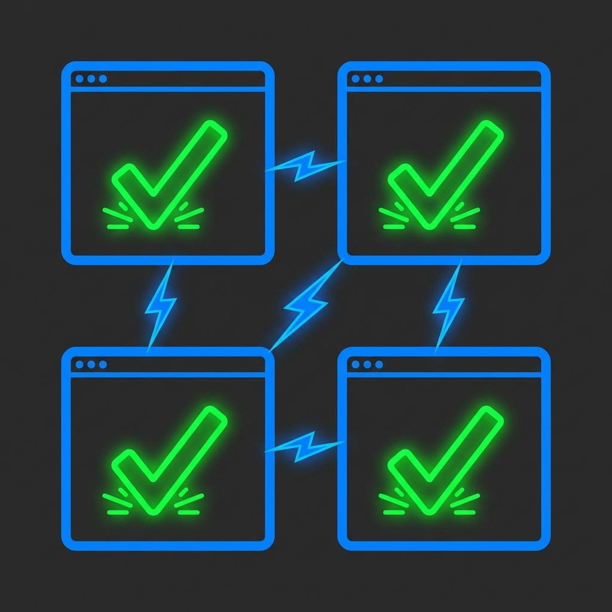

> [!CAUTION]
> **DO NOT USE THIS TOOL ON CORPORATE HARDWARE OR CONNECTED TO A CORPORATE NETWORK.**
>
> This tool auto-approves all Claude Code permission prompts without human review, including destructive commands. For maximum isolation, run it on a **dedicated bare-metal server** with no personal data, no saved credentials, and no access to sensitive networks. You accept full responsibility for any consequences.

# claude-yolo

Run parallel Claude Code agents in tmux with automatic permission approval.

When organization-managed settings force `ask` mode for tools like `Bash`, `Bash(rm:*)`, and `WebFetch`, this tool auto-approves those prompts at the terminal level using `tmux capture-pane` + `send-keys`.

## Table of contents

- [Installation](#installation)
- [Quick start](#quick-start)
- [Navigation](#navigation)
- [Options](#options)
- [How it works](#how-it-works)
  - [Detection signals](#detection-signals)
- [File structure](#file-structure)
- [Prerequisites](#prerequisites)
- [Testing](#testing)
- [Key features](#key-features)
- [Development history](#development-history)

## Installation

**One-liner** (macOS, Linux, WSL):

```bash
curl -fsSL https://raw.githubusercontent.com/claude-yolo/claude-yolo/refs/heads/main/install.sh | bash
```

This clones to `~/.claude-yolo` and symlinks the binary into `~/.local/bin`. It also installs `tmux` and `claude` (Claude Code CLI) if they are missing. Override the install location with `CLAUDE_YOLO_HOME`:

```bash
CLAUDE_YOLO_HOME=~/my/path curl -fsSL https://raw.githubusercontent.com/claude-yolo/claude-yolo/refs/heads/main/install.sh | bash
```

**Manual install:**

```bash
git clone https://github.com/claude-yolo/claude-yolo.git ~/.claude-yolo
ln -s ~/.claude-yolo/claude-yolo ~/.local/bin/claude-yolo
```

Then run from any project directory:

```bash
cd /path/to/your/project
claude-yolo "fix the tests" "update docs"
```

The tool runs agents in whatever directory you invoke it from (or the `--dir` path if specified).

## Quick start

```bash
# Run three agents in parallel
claude-yolo "fix the login bug" "add unit tests for auth" "update the README"

# Use a specific model
claude-yolo --model opus "refactor the API layer"

# Point agents at a different project
claude-yolo --dir /path/to/project "run the test suite and fix failures"
```

Once launched, you're inside a tmux session with one window per agent. The last window (`control`) tails the audit log in real time.

## Navigation

| Key | Action |
|---|---|
| `Ctrl-b w` | List all agent windows and select one |
| `Ctrl-b s` | Switch between agent windows |
| `Ctrl-b n` | Next pane |
| `Ctrl-b p` | Previous pane |
| `Ctrl-b x` | Stop the current agent, close pane |
| `Ctrl-b d` | Detach (agents keep running) |

Re-attach later with `claude-yolo --resume` or `tmux attach -t yolo-*`.

## Options

```
--session NAME    Custom tmux session name (default: yolo-<timestamp>)
--dir PATH        Working directory for agents (default: current directory)
--model MODEL     Claude model to use (e.g., opus, sonnet, haiku)
--poll SECONDS    Approver poll interval (default: 0.3)
--resume          Re-attach to an existing yolo session
-h, --help        Show help
```

## How it works

1. **Launcher** (`claude-yolo`) creates a tmux session and spawns one window per task, each running `claude`.
2. **Approver daemon** (`lib/approver-daemon.sh`) runs in the background, polling every 0.3s. For each pane it:
   - Captures visible content via `tmux capture-pane`
   - Detects three prompt styles (see below)
   - Sends `Enter` via `tmux send-keys` to confirm the pre-selected option
   - If the transcript is collapsed (`● Bash(...)` visible but prompt hidden), sends `Ctrl+O` to expand it first — the next poll cycle then approves
   - Applies a 2-second per-pane cooldown to prevent double-approvals
3. **Audit log** at `/tmp/claude-yolo-<session>.log` records every approval with timestamp, pane ID, and matched pattern. Each session gets its own log, so concurrent claude-yolo processes don't interfere.

### Detection signals

The approver requires the primary signal plus at least one secondary signal to fire:

**Expanded view** — requires primary + secondary signal:

| Signal | Type | Patterns |
|---|---|---|
| Allow + Deny | Primary (either) | Both `Allow` and `Deny` in last 20 lines |
| N. Yes / N. No | Primary (either) | Numbered options like `1. Yes` and `2. No` |
| Tool keywords | Secondary (at least one) | `Bash`, `WebFetch`, `Read`, `Write`, `Edit`, `execute`, `run` |
| Context phrases | Secondary (at least one) | `want to proceed`, `wants to execute`, `wants to run`, `permission`, `allow once`, `allow always` |

**Collapsed view** — detected when the transcript is toggled off:

| Signal | Patterns |
|---|---|
| Pending tool indicator | `● Bash(...)`, `● WebFetch(...)`, `● Read(...)`, etc. |
| Collapsed view marker | `Showing detailed transcript` in the last 10 lines |

When a collapsed view is detected, the daemon sends `Ctrl+O` to expand it, then detects and approves the prompt on the next poll cycle.

## File structure

```
claude-yolo              # Main launcher script
lib/
  common.sh              # Logging, prerequisite checks
  approver-daemon.sh     # tmux capture-pane monitor + auto-approver
test_approver.sh         # Test suite (131 tests)
```

## Prerequisites

- **tmux** (tested with 3.4)
- **claude** (Claude Code CLI)

## Testing

```bash
# Run all tests
bash test_approver.sh

# Verbose output (shows passing tests)
bash test_approver.sh -v

# Filter by pattern
bash test_approver.sh WebFetch
bash test_approver.sh "Bash(rm"
bash test_approver.sh Integration
```

The test suite covers:
- Prompt detection for Bash, Bash(rm:\*), and WebFetch permission patterns
- False positive resistance (code output, markdown, missing signals)
- Cooldown logic, command construction, audit logging
- End-to-end integration tests using real tmux sessions

## Key features

- **Parallel multi-agent execution** — Uniquely enables parallel execution of multiple Claude Code agents in tmux with non-invasive, terminal-level auto-approval of permissions.
- **Sophisticated detection logic** — Handles both expanded and collapsed transcript views without modifying the Claude CLI or relying on the `--dangerously-skip-permissions` flag.
- **Reliability and traceability** — Per-pane cooldowns, detailed audit logging, and an extensive test suite emphasize reliability and traceability.
- **No CLI patching or containerization** — Unlike most alternatives, avoids direct CLI patching or containerization, making it suitable for environments where `ask` mode is enforced.

## Development history

This tool was built iteratively through real-world testing against Claude Code v2.1.42. Key discoveries along the way:

1. **Prompt format**: Claude Code renders permission prompts as `❯ 1. Yes / 2. No` with `Do you want to proceed?` and `Permission rule Bash requires confirmation`. An older `Allow / Deny` button style also exists — both are supported.

2. **Approval keystroke**: Sending `y` via `tmux send-keys` does nothing. Only `Enter` works because the prompt has a pre-selected option (`❯ 1. Yes`).

3. **Collapsed transcript view**: When Claude Code's transcript is toggled off, `tmux capture-pane` shows `● Bash(ls ...)` and `Showing detailed transcript` but no permission prompt text. The daemon detects this state and sends `Ctrl+O` to expand the transcript, then approves on the next poll cycle.

4. **Multi-signal detection**: Simple keyword matching produces too many false positives (code output, markdown, log messages). The two-tier approach (primary signal + secondary signal) eliminates these.

5. **Per-pane cooldown**: Without a cooldown, the 0.3s poll interval can send multiple `Enter` keystrokes for the same prompt. A 2-second per-pane cooldown prevents double-approvals.
